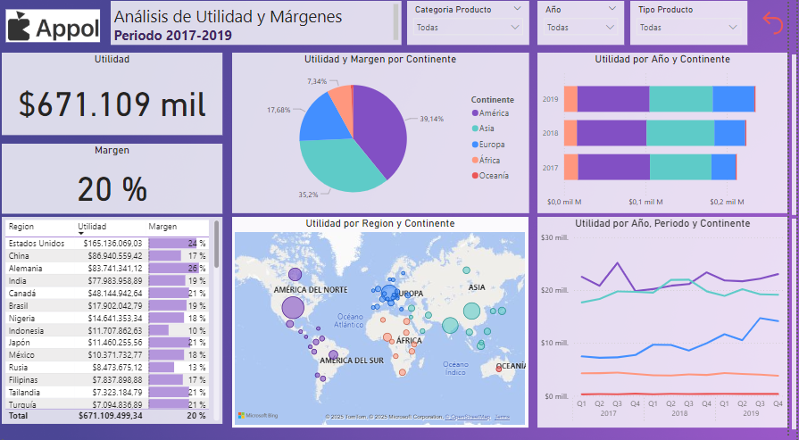

# Reporte de Análisis Utilidad y Margénes(2017-2019)

**Cliente:** Appol

**Fecha de Elaboración:** 23/01/2025

**Autor:** Nathaly Castro

# Resumen Ejecutivo 
Durante el período 2017-2019, Appol obtuvo una utilidad total de **$671.109 millones**, con un margen promedio del **20%**. Este análisis detalla el desempeño financiero por continente, región, y períodos, permitiendo identificar las áreas de mayor rentabilidad y oportunidades de mejora.

# Hallazgos Principales

 1. ### Utilidad Total y Márgenes
    •	Utilidad Total: $671.109 millones.

    •	Margen Promedio: 20%.
 2. ### Utilidad y Margen por Continente
    •	América representa el **39.14%** de la utilidad total, siendo el continente con mayor contribución.

    •	Europa y Asia siguen con el **35.2%** y **17.4%**, respectivamente.

    •	África y Oceanía presentan contribuciones más bajas.
 3. ### Regiones Destacadas
    •	Los Estados Unidos lideran con una utilidad de **$166.1 mil millones**, representando el 24% del total.

    •	China, Alemania e India son otras regiones clave, con un margen promedio del **15-22%**.
 4. ### Tendencias Anuales y Trimestrales
    •	El año **2019** muestra un crecimiento constante en utilidad, destacándose sobre los años anteriores.

    •	**Los primeros trimestres (Q1)** en los tres años analizados son los de menor rendimiento en utilidad

# Visualizaciones Clave
1.	**Gráfica Circular:** Distribución de utilidad y márgenes por continente.
2.	**Gráfica de Barras:** Comparación anual de utilidad por continente.
3.	**Mapa Geográfico:** Distribución de la utilidad por regiones específicas.
4.	**Gráfica de Líneas:** Tendencias trimestrales de utilidad por continente.

# Recomendaciones
1.	**Expandir Operaciones en América y Europa:** Continuar reforzando estrategias en estas regiones, ya que generan las mayores utilidades.
2.	**Fortalecer Presencia en Asia:** Aunque tiene un buen desempeño, existe un margen para aumentar la utilidad mediante campañas localizadas.
3.	**Optimizar Primeros Trimestres:** Desarrollar iniciativas para incrementar las ventas y utilidades en el primer trimestre, ya que es el periodo más débil.

